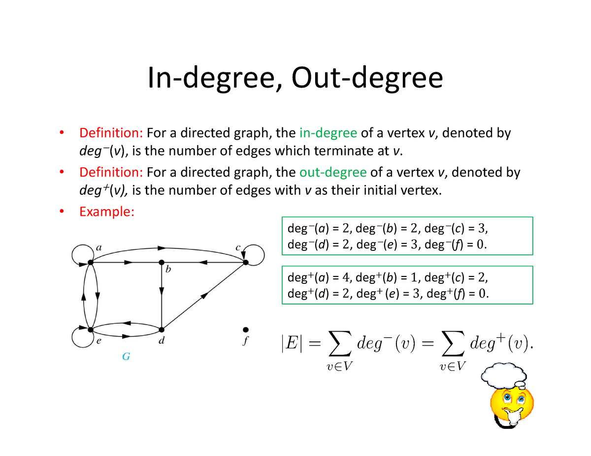
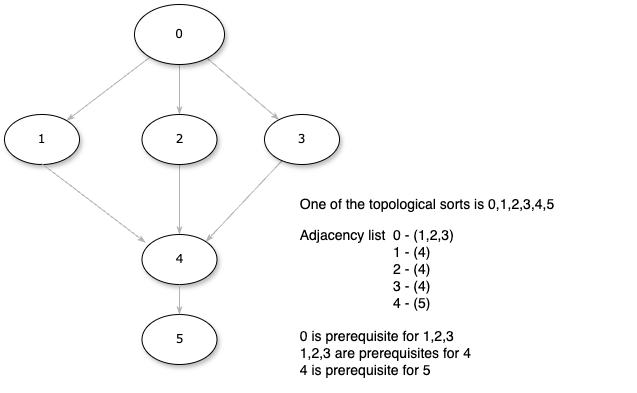

## What is Graph

A graph is a data structure that consists of nodes (vertices) and edges that connect these nodes.

Link to nice cheatsheet: [LeetCode Discuss](https://leetcode.com/tag/topological-sort/discuss/3900838/%22Mastering-Graph-Algorithms%3A-A-Comprehensive-DSA-Graph-Common-Question-Patterns-CheatSheet%22)


## How to represent? Adjacency list
An adjacency list is a common way to represent a graph in computer science.
It's a data structure that stores information about the connections between vertices (nodes) in a graph. Here's how it works:

* Each vertex in the graph is associated with a list of its neighboring vertices.
* For an undirected graph, each vertex's adjacency list contains all the vertices that are directly connected to it by an edge.
* For a directed graph, each vertex's adjacency list contains only the vertices to which it has outgoing edges.

## Types of Graphs

### Undirected
An undirected graph is a type of graph in which edges do not have a direction associated with them.
In other words, the relationship between vertices (nodes) is symmetric; if there is an edge from vertex A to vertex B, there is also an edge from vertex B to vertex A.


### Directed

A directed graph, also known as a digraph, is a type of graph in which edges have a direction associated with them. 
This means that the relationship between vertices (nodes) is asymmetric; if there is an edge from vertex A to vertex B, 
it does not necessarily imply that there is an edge from vertex B to vertex A. 
Directed graphs can be further classified into two main categories based on the presence or absence of cycles.


### Directed Acyclic Graph

A directed acyclic graph is a directed graph that does not contain any cycles. 
This means that it is impossible to traverse the graph starting from any vertex and following the direction of edges to 
return to the same vertex.
In other words, there are no loops in a DAG.


### Directed Graph with Cycles

A directed graph with cycles is a directed graph that contains at least one cycle. 
A cycle is a path in the graph that starts and ends at the same vertex, following a sequence of directed edges. 
In other words, it is possible to traverse the graph from a vertex and return to the same vertex by following a sequence of directed edges.

### Weighted graphs

Each edge in a weighted graph has an associated weight. The weight can be of any metric, 
such as time, distance, size, etc. The most commonly seen “weighted map” in our daily life might be a city map.


### Tree
Trees have direction (parent / child relationships) and don't contain cycles. They fit with in the category of Directed Acyclic Graphs (or a DAG).
So Trees are DAGs with the restriction that a child can only have one parent.


## Terminologies

### In-degree, Out-degree


## Represent Graph in Java

```Java
Map<Integer, List<Integer>> adjList = new HashMap<>();
```

```Java
    private Map<Integer, List<Integer>> adjList; // Map to represent adjacency list

    // Constructor
    public Graph() {
        adjList = new HashMap<>();
    }

    // Function to add an edge to the graph
    public void addEdge(int v, int w) {
        adjList.putIfAbsent(v, new ArrayList<>());
        adjList.get(v).add(w); // Add w to v's list
    }
```

## Traverse

### BFS

* BFS explores a graph level by level, starting from a given vertex.
* It visits all the vertices at the current level before moving to the vertices at the next level.
* BFS is typically implemented using a queue data structure.
* It's useful for finding the shortest path in an unweighted graph.
* BFS in Java can be implemented using a queue, to keep track of vertices to visit next.


If we imagine first element being in center or circle and the next levels as its radius.

```Java
// Function to perform BFS traversal starting from a given vertex
    public void bfs(Map<Integer, List<Integer>> adjList, int startVertex) {
        Set<Integer> visited = new HashSet<>(); // Set to keep track of visited vertices
        LinkedList<Integer> queue = new LinkedList<>(); // Queue for BFS

        visited.add(startVertex); // Mark the start vertex as visited
        queue.add(startVertex); // Enqueue the start vertex

        while (!queue.isEmpty()) {
            int currentVertex = queue.poll(); // Dequeue a vertex
            System.out.print(currentVertex + " ");

            // Visit all adjacent vertices of the dequeued vertex
            for (int neighbor : adjList.getOrDefault(currentVertex, Collections.emptyList())) {
                if (!visited.contains(neighbor)) {
                    visited.add(neighbor);
                    queue.add(neighbor);
                }
            }
        }
    }
```
### DFS
* DFS explores a graph by going as deep as possible along each branch before backtracking.
* DFS is typically implemented using recursion or a stack data structure.
* It's useful for topological sorting, finding strongly connected components, and detecting cycles in a graph.

Recursive
```Java
    // Function to perform DFS traversal starting from a given vertex
    public void dfs(Map<Integer, List<Integer>> adjList, int startVertex) {
        Set<Integer> visited = new HashSet<>(); // Set to keep track of visited vertices
        dfs(adjList, startVertex, visited);
    }

    // Recursive utility function for DFS traversal
    private void dfs(Map<Integer, List<Integer>> adjList, int vertex, Set<Integer> visited) {
        visited.add(vertex);
        System.out.print(vertex + " ");

        // Recursively visit all adjacent vertices of the current vertex
        for (int neighbor : adjList.getOrDefault(vertex, Collections.emptyList())) {
            if (!visited.contains(neighbor)) {
                dfs(adjList, neighbor, visited);
            }
        }
    }
```

Using Stack
```Java
 // Function to perform DFS traversal starting from a given vertex
    public void dfs(Map<Integer, List<Integer>> adjList, int startVertex) {
        Set<Integer> visited = new HashSet<>(); // Set to keep track of visited vertices
        Stack<Integer> stack = new Stack<>(); // Stack for DFS

        stack.push(startVertex); // Push the start vertex onto the stack

        while (!stack.isEmpty()) {
            int currentVertex = stack.pop(); // Pop a vertex from the stack

            // Visit the current vertex if it has not been visited before
            if (!visited.contains(currentVertex)) {
                System.out.print(currentVertex + " ");
                visited.add(currentVertex);

                // Push all adjacent vertices of the current vertex onto the stack
                for (int neighbor : adjList.getOrDefault(currentVertex, Collections.emptyList())) {
                    if (!visited.contains(neighbor)) {
                        stack.push(neighbor);
                    }
                }
            }
        }
    }
```

Test
```Java
public static void main(String[] args) {
        Graph graph = new Graph();
        graph.addEdge(0, 1);
        graph.addEdge(0, 4);
        graph.addEdge(1, 2);
        graph.addEdge(1, 3);
        graph.addEdge(1, 4);
        graph.addEdge(2, 3);
        graph.addEdge(3, 4);

        System.out.print("BFS traversal starting from vertex 0: ");
        bsf(graph.getAdjList(), 0);
        System.out.println();

        System.out.print("DFS traversal starting from vertex 0: ");
        dsf(graph.getAdjList(), 0);
    }
```

## Number of Connected Components

We can do DSF of BSF from each key in adjacency list and store visited into shared set:
when adjacency list key is not visited yet - we increase number of connected components by one.


```java
    public int numberOfConnectedComponentsBfs(Map<Integer, List<Integer>> adj) {
        Set<Integer> visited = new HashSet<>();
        int ret = 0;
        for (Integer key : adj.keySet()) {
            if (!visited.contains(key)) {
                ret++;
            }
            bfs(adj, key, visited);
        }
        return ret;
    }

    public void bfs(Map<Integer, List<Integer>> adj, int startVertex, Set<Integer> visited) {
        LinkedList<Integer> queue = new LinkedList<>(); // Queue for BFS

        visited.add(startVertex); // Mark the start vertex as visited
        queue.add(startVertex); // Enqueue the start vertex

        while (!queue.isEmpty()) {
            int currentVertex = queue.poll(); // Dequeue a vertex

            // Visit all adjacent vertices of the dequeued vertex
            for (int neighbor : adj.getOrDefault(currentVertex, Collections.emptyList())) {
                if (!visited.contains(neighbor)) {
                    visited.add(neighbor);
                    queue.add(neighbor);
                }
            }
        }
    }
```

```java
    public int numberOfConnectedComponentsDfs(Map<Integer, List<Integer>> adj) {
        Set<Integer> visited = new HashSet<>();
        int ret = 0;
        for (Integer key : adj.keySet()) {
            if (!visited.contains(key)) {
                ret++;
            }
            dfs(adj, key, visited);
        }
        return ret;
    }

    public void dfs(Map<Integer, List<Integer>> adjList, int startVertex, Set<Integer> visited) {
        Stack<Integer> stack = new Stack<>(); // Stack for DFS

        stack.push(startVertex); // Push the start vertex onto the stack

        while (!stack.isEmpty()) {
            int currentVertex = stack.pop(); // Pop a vertex from the stack

            // Visit the current vertex if it has not been visited before
            if (!visited.contains(currentVertex)) {
                visited.add(currentVertex);

                // Push all adjacent vertices of the current vertex onto the stack
                for (int neighbor : adjList.getOrDefault(currentVertex, Collections.emptyList())) {
                    if (!visited.contains(neighbor)) {
                        stack.push(neighbor);
                    }
                }
            }
        }
    }
```

## Topological Sort

Topological sort or topological ordering of a directed graph is a linear ordering of its vertices such that for every directed edge (u,v) 
from vertex u to vertex v, u comes before v in the ordering.

A topological ordering is possible if and only if the graph has no directed cycles, that is, if it is a directed acyclic graph (DAG). 
Any DAG has at least one topological ordering.

The canonical application of topological sorting is in scheduling a sequence of jobs or tasks based on their dependencies. 
The jobs are represented by vertices, and there is an edge from x to y if job x must be completed before job y can be started 
(for example, when washing clothes, the washing machine must finish before we put the clothes in the dryer). 
Then, a topological sort gives an order in which to perform the jobs. 

### Kahn's algorithm



https://en.wikipedia.org/w/index.php?title=Topological_sorting
Works by choosing vertices in the same order as the eventual topological sort. First, find a list of "start nodes" that have no incoming edges and remove
corresponding edges from the graph. Then repeat.

No incoming edges means that in-degree is 0.

```
L ← Empty list that will contain the sorted elements
S ← Set of all nodes with no incoming edge

while S is not empty do
    remove a node n from S
    add n to L
    for each node m with an edge e from n to m do
        remove edge e from the graph
        if m has no other incoming edges then
            insert m into S

if graph has edges then
    return error   (graph has at least one cycle)
else 
    return L   (a topologically sorted order)
```

```java
public class KahnsTopoSort {
    private static int[] topoSort(Map<Integer, List<Integer>> adjList, int[] indegree) {
        Queue<Integer> queue = new LinkedList<>();

        for (int i = 0; i <= indegree.length - 1; i++) {
            if (indegree[i] == 0) {
                queue.add(i);
            }
        }

        List<Integer> ret = new ArrayList<>();

        while (!queue.isEmpty()) {
            int current = queue.poll();
            ret.add(current);

            for (Integer prerequisiteFor : adjList.getOrDefault(current, new ArrayList<>())) {
                indegree[prerequisiteFor]--;

                if (indegree[prerequisiteFor] == 0) {
                    queue.add(prerequisiteFor);
                }
            }
        }

        if (ret.size() == indegree.length) {
            return ret
                    .stream()
                    .mapToInt(Integer::valueOf)
                    .toArray();
        }

        return new int[0];
    }
}
```

### DFS

The algorithm loops through each node of the graph, in an arbitrary order, 
initiating a depth-first search that terminates when it hits any node that has already been visited since 
the beginning of the topological sort or the node has no outgoing edge.

Note that output is build in the reverse order. Node is added to the output only after all its descendants(that depends on it)
are added.

```java
public class DfsTopoSort {
    public static List<Integer> topoSortDfs(Map<Integer, List<Integer>> adjList) {
        Set<Integer> visited = new HashSet<>(); // Set to keep track of visited vertices
        List<Integer> ret = new ArrayList<>();
        for (Integer i : adjList.keySet()) {
            Set<Integer> cyclesDetection = new HashSet<>();
            AtomicBoolean cycleFound = new AtomicBoolean(false);
            topoSortUtil(adjList, i, visited, cyclesDetection, cycleFound, ret);
            if (cycleFound.get()) {
                return new ArrayList<>();
            }
        }
        Collections.reverse(ret);
        return ret;
    }

    private static void topoSortUtil(Map<Integer, List<Integer>> adjList,
                                     Integer vertex,
                                     Set<Integer> visited,
                                     Set<Integer> cycleDetection,
                                     AtomicBoolean cycleFound,
                                     List<Integer> ret) {
        if (visited.contains(vertex)) {
            return;
        }
        if (cycleDetection.contains(vertex)) {
            cycleFound.set(true);
            return;
        }
        cycleDetection.add(vertex);
        for (int neighbor : adjList.getOrDefault(vertex, Collections.emptyList())) {
            topoSortUtil(adjList, neighbor, visited, cycleDetection, cycleFound, ret);
        }
        visited.add(vertex);
        ret.add(vertex);
    }
}
```